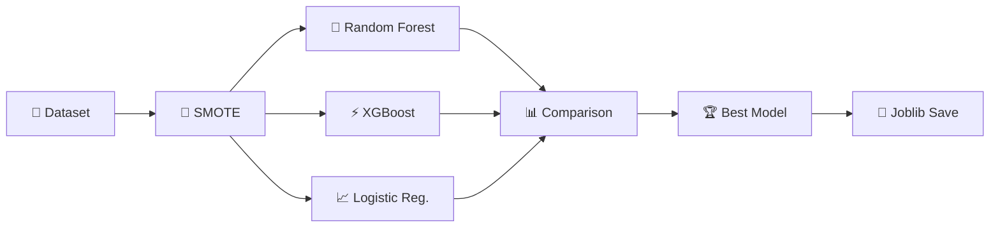

# 🎬 Netflix Customer Churn Prediction

<div align="center">

### 🎯 Predicting Customer Churn with Machine Learning to Drive Retention Strategies

[](https://github.com/your-username/Netflix_churn)
[](https://www.python.org/)
[](LICENSE)
[](https://netflix-customer-churn-predictor.onrender.com/)
[](http://kaggle.com/datasets/abdulwadood11220/netflix-customer-churn-dataset)

</div>

---

## 📑 Table of Contents

- [🎥 Demo](#-demo)
- [📊 Overview](#-overview)
- [💡 Motivation](#-motivation)
- [⚙️ Technical Aspect](#️-technical-aspect)
- [🔧 Installation](#-installation)
- [🚀 Run](#-run)
- [☁️ Deployment on Render](#️-deployment-on-render)
- [📁 Directory Tree](#-directory-tree)
- [✅ To Do](#-to-do)
- [🐛 Bug / Feature Request](#-bug--feature-request)
- [💻 Technologies Used](#-technologies-used)
- [👥 Team](#-team)
- [📄 License](#-license)
- [🙏 Credits](#-credits)

---

## 🎥 Demo

<div align="center">

### **🌐 [Live Demo](https://netflix-customer-churn-predictor.onrender.com/)**

![Demo Screenshot - It might take few minutes to load as I'm using free hosting]

*Interactive Streamlit dashboard for real-time churn predictions*

</div>


---

## 📊 Overview

This project addresses the critical business problem of **customer churn** in subscription-based streaming services. The goal is to predict whether a customer will churn (cancel their subscription) based on behavioral and demographic features.

<div align="center">

| 🎯 **Target Variable** | 📈 **ML Algorithm** | 🔄 **Balancing Technique** | 🎨 **Frontend** |
|:---:|:---:|:---:|:---:|
| `churn` (binary) | XGBoost | SMOTE | Streamlit |

</div>

### 🔍 **Approach**

The solution leverages supervised machine learning with **XGBoost** as the primary classifier. The pipeline includes:

- ✨ Data preprocessing and cleaning
- 🛠️ Feature engineering (creating engagement indicators)
- ⚖️ Handling class imbalance with SMOTE
- 🎓 Model training with hyperparameter optimization
- 🌐 Interactive web deployment via Streamlit

---

## 💡 Motivation

<div align="center">

### 🎯 **Why Churn Prediction Matters**

</div>

Customer retention is **paramount** for subscription-based businesses like Netflix. Research shows:

- 💰 Acquiring new customers costs **5-25x more** than retaining existing ones
- 📈 A **5% increase** in customer retention can boost profits by **25-95%**
- 🎪 Personalized retention campaigns have **3x higher** success rates

By predicting churn early, companies can implement targeted retention campaigns, offer personalized incentives, and improve overall customer lifetime value. This project demonstrates how machine learning can transform customer data into actionable business intelligence, reducing churn rates and maximizing revenue.

---

## ⚙️ Technical Aspect

### 🏗️ **Architecture Overview**
```
┌─────────────┐      ┌──────────────┐      ┌─────────────────┐      ┌──────────────┐
│   Raw Data  │─────▶│ Preprocessing│─────▶│Feature Engineer.│─────▶│SMOTE Resample│
│  (Kaggle)   │      │  & Cleaning  │      │  + Scaling      │      │   (Balance)  │
└─────────────┘      └──────────────┘      └─────────────────┘      └───────┬──────┘
                                                                              │
┌─────────────┐      ┌──────────────┐      ┌─────────────────┐             │
│  Streamlit  │◀─────│  Predictions │◀─────│  Trained Model  │◀────────────┘
│     UI      │      │   (Joblib)   │      │    (XGBoost)    │
└─────────────┘      └──────────────┘      └─────────────────┘
```

### 🔬 **Key Preprocessing & Feature Engineering Steps**

| Step | Description | Tool |
|------|-------------|------|
| 🧹 **Missing Values** | Imputation for numerical and categorical features | pandas |
| 🔤 **Encoding** | One-hot encoding for categorical variables | scikit-learn |
| 📏 **Scaling** | Standardization of numerical features | StandardScaler |
| 📊 **Engagement Metric** | Created `low_engagement` from `avg_watch_time_per_day` | Custom logic |
| 🎯 **Domain Features** | `support_ticket_frequency`, `device_count` indicators | Feature engineering |

### 🤖 **Modeling Pipeline**


#### 📈 **Evaluation Metrics**

<div align="center">

| Metric | Score |
|:------:|:-----:|
| 🎯 **ROC AUC** | `<ROC_AUC>` |
| ✅ **Accuracy** | `<ACCURACY>` |
| 🎪 **Precision** | `<PRECISION>` |
| 🔍 **Recall** | `<RECALL>` |
| ⚖️ **F1 Score** | `<F1_SCORE>` |

</div>

#### 🔧 **Model Development Steps**

1. **⚖️ Class Imbalance:** Applied SMOTE for balanced training
2. **🔬 Model Selection:** Compared XGBoost, Random Forest, Logistic Regression
3. **🎛️ Hyperparameter Tuning:** GridSearchCV for optimal parameters
4. **📦 Serialization:** Complete pipeline saved with Joblib

---

## 🔧 Installation

<div align="center">

### 🛠️ **Setup Instructions**

</div>

# 📥 Clone the repository
```bash
git clone https://github.com/<your-username>/Netflix_churn.git
cd Netflix_churn
```

# 🐍 Create virtual environment
```bash
python -m venv .venv
```
# ⚡ Activate virtual environment
# On Windows:
```bash
.venv\Scripts\activate
# On macOS/Linux:
source .venv/bin/activate
```

# 📦 Install dependencies
```bash

pip install --upgrade pip
pip install -r requirements.txt
```

### 📊 **Download Dataset**

<div align="center">

[](http://kaggle.com/datasets/abdulwadood11220/netflix-customer-churn-dataset)

</div>

**Option 1: Manual Download**

1. Visit the [dataset page](http://kaggle.com/datasets/abdulwadood11220/netflix-customer-churn-dataset)
2. Download `netflix_customer_churn.csv`
3. Place it in `data/netflix_customer_churn.csv`

**Option 2: Kaggle API**
```bash
# 🔑 Configure Kaggle API credentials
kaggle datasets download -d abdulwadood11220/netflix-customer-churn-dataset
unzip netflix-customer-churn-dataset.zip -d data/
```

---

## 🚀 Run

### 1️⃣ **Train the Model**

<div align="center">


</div>
```bash
jupyter notebook notebooks/01_preprocessing_and_modeling.ipynb
```

**📋 This notebook will:**

- 📂 Load and explore the dataset
- 🔧 Perform feature engineering and preprocessing
- 🤖 Train the XGBoost model with SMOTE
- 📊 Generate evaluation metrics and visualizations
- 💾 Save the model pipeline to `model/model_pipeline.pkl`

---

### 2️⃣ **Run Prediction Script**

<div align="center">


</div>
```bash
python src/predict.py
```

**📝 Example Input (CSV row):**
```csv
subscription_type,monthly_revenue,avg_watch_time_per_day,total_watch_time,support_tickets_raised,device_count
Premium,15.99,120,3600,1,3
```

---

### 3️⃣ **Run Streamlit App Locally**

<div align="center">


</div>
```bash
streamlit run src/app.py
```

🌐 **The app will open at:** `http://localhost:8501`

**✨ Features:**

- 📝 Input customer features via user-friendly form
- ⚡ Get instant churn predictions with probability scores
- 📊 View feature importance and model explanations
- 🎨 Interactive visualizations with Plotly

**📋 Example Input JSON:**
```json
{
  "subscription_type": "Premium",
  "monthly_revenue": 15.99,
  "avg_watch_time_per_day": 120,
  "total_watch_time": 3600,
  "support_tickets_raised": 1,
  "device_count": 3,
  "payment_method": "Credit Card"
}
```

---

## ☁️ Deployment on Render

<div align="center">


### 🌐 **[View Live App](https://netflix-customer-churn-predictor.onrender.com/)**

</div>

### ⚙️ **Render Configuration**

#### 🔨 **Build Command:**
```bash
pip install -r requirements.txt
```

#### 🚀 **Start Command:**
```bash
streamlit run src/app.py --server.port=$PORT --server.address=0.0.0.0
```

### 🎛️ **Environment Settings**

| Setting | Value |
|---------|-------|
| 🐍 **Environment** | Python 3 |
| 🌍 **Region** | US West (or closest to audience) |
| 💻 **Instance Type** | Free / Starter |

### ⚠️ **Important Notes**

- 🔌 Render automatically assigns `$PORT` - the flag ensures Streamlit binds correctly
- 🌐 `--server.address=0.0.0.0` makes the app externally accessible
- 📦 Ensure `requirements.txt` includes all dependencies with pinned versions
- ⏱️ Cold start may take 30-60 seconds on free tier instances
- 🔄 Auto-deploys from GitHub on push to main branch

---

## 📁 Directory Tree
```
Netflix_churn/
│
├── 📁 .venv/                          # Virtual environment (not in Git)
│
├── 📁 data/
│   └── 📄 netflix_customer_churn.csv  # Raw dataset from Kaggle
│
├── 📁 notebooks/
│   └── 📓 01_preprocessing_and_modeling.ipynb  # EDA & Model training
│
├── 📁 src/
│   ├── 🎨 app.py                      # Streamlit web application
│   └── 🔮 predict.py                  # Batch prediction script
│
├── 📁 model/
│   └── 💾 model_pipeline.pkl          # Serialized ML pipeline
│
├── 📁 assets/
│   ├── 📊 feature_importance.html     # Interactive Plotly chart
│   ├── 📊 feature_importance.png      # Static feature importance
│   ├── 📈 roc_curve.html              # Interactive ROC curve
│   └── 📸 screenshot_demo.png         # App screenshot for README
│
├── 📄 requirements.txt                # Python dependencies
├── 📖 README.md                       # Project documentation
└── 🚫 .gitignore                      # Git ignore rules
```

---

## ✅ To Do

<div align="center">

### 🎯 **Future Enhancements**

</div>

- [ ] 🐳 **Dockerization:** Create Dockerfile for containerized deployment
- [ ] 🔄 **CI/CD Pipeline:** Set up GitHub Actions for automated testing and deployment
- [ ] 🎛️ **Hyperparameter Tuning:** Implement Bayesian optimization (Optuna) for better model performance
- [ ] 📊 **Model Monitoring:** Add MLflow or Weights & Biases for experiment tracking
- [ ] 🧪 **A/B Testing Framework:** Enable real-time model comparison
- [ ] 🔌 **API Endpoint:** Build FastAPI REST API for production integration
- [ ] 🔍 **Explainability Dashboard:** Add SHAP values for individual prediction explanations
- [ ] ⏰ **Automated Retraining:** Schedule periodic model updates with new data
- [ ] 📱 **Mobile Responsive UI:** Optimize Streamlit app for mobile devices
- [ ] 🔐 **Authentication:** Add user login for personalized dashboards

---

## 🐛 Bug / Feature Request

<div align="center">

### 💬 **We'd Love to Hear From You!**

</div>

If you encounter any bugs or have feature suggestions:

1. 🔍 Navigate to the **[Issues](https://github.com/Dracksnoop/Netflix-Customer-Churn-Predictor/issues/new)** tab
2. 🆕 Click **New Issue**
3. 📝 Provide:
   - 🐛 Bug description or feature proposal
   - 🔄 Steps to reproduce (for bugs)
   - ✅ Expected vs actual behavior
   - 📸 Screenshots if applicable

**Or submit a Pull Request!**

[](https://github.com/<your-username>/Netflix_churn/issues)
[](https://github.com/<your-username>/Netflix_churn/pulls)

---

## 💻 Technologies Used

<div align="center">

### 🛠️ **Tech Stack**

</div>

<div align="center">

#### **Languages & Core**


#### **Data Science & ML**


#### **Visualization**


#### **Frontend & Deployment**


#### **Tools & Utilities**


</div>

### 📚 **Detailed Library List**

| Category | Libraries |
|----------|-----------|
| 🐍 **Core** | Python 3.8+ |
| 📊 **Data Processing** | pandas, NumPy |
| 🤖 **Machine Learning** | scikit-learn, XGBoost, imbalanced-learn (SMOTE) |
| 📈 **Visualization** | Plotly, Matplotlib, Seaborn |
| 🌐 **Web Framework** | Streamlit |
| 💾 **Model Persistence** | Joblib |
| 📓 **Development** | Jupyter Notebook, IPython |

---

## 👥 Team

<div align="center">

### 👨‍💻 **Project Creator**

**[Your Name]**

[](https://github.com/your-username)
[](https://linkedin.com/in/your-profile)
[](mailto:your.email@example.com)
[](https://your-portfolio.com)

</div>

---

## 📄 License

<div align="center">

This project is licensed under the **MIT License**

[](LICENSE)

See the [LICENSE](LICENSE) file for details.

</div>

---

## 🙏 Credits

<div align="center">

### 📚 **Acknowledgments**

</div>

- 📊 **Dataset:** [Netflix Customer Churn Dataset](http://kaggle.com/datasets/abdulwadood11220/netflix-customer-churn-dataset) by Abdul Wadood on Kaggle
- 💡 **Inspiration:** Customer retention strategies and churn prediction research in subscription-based businesses
- 🛠️ **Open Source Libraries:** Special thanks to the communities behind:
  - scikit-learn
  - XGBoost
  - Streamlit
  - imbalanced-learn
  - Plotly

---

<div align="center">

### ⭐ **If you find this project useful, please consider giving it a star!** ⭐

[](https://github.com/your-username/Netflix_churn)

---

**Made with ❤️ and ☕ for the Data Science Community**


</div>
